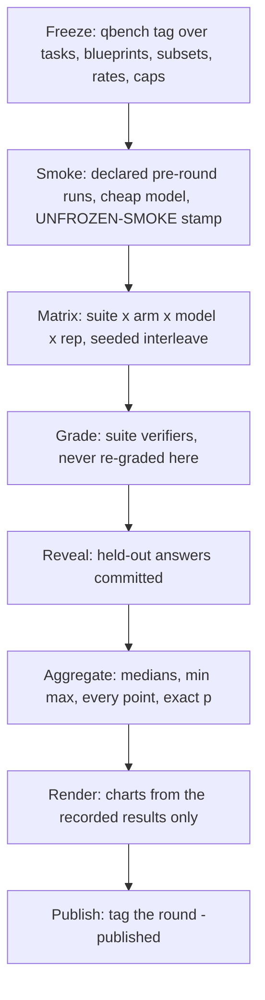

# Benchmark methodology

This document is the contract every published number from this repo
must satisfy. Its rules exist because they are the ones that make
small-sample benchmark numbers trustworthy at all; several were
adopted after an earlier internal round failed an audit, and each rule
closes a concrete failure mode.

## What is measured, and what deliberately is not

This repo benchmarks **leviath only**. It never runs another product
or framework, and it publishes no head-to-head bars: any baseline we
built ourselves would be permanently open to the objection that we
wrote the loser. Comparability comes from running **external,
independently maintained suites with deterministic verifiers** - their
public leaderboards already carry other systems' numbers under those
suites' own conditions, and readers can line results up themselves.

Two kinds of number are published:

1. **Ablations of leviath against itself** - same binary, same pinned
   model, same tools, one variable changed. The flagship is context
   structure.
2. **Absolute measurements** - resource footprint, cold start,
   throughput - with no comparison bars.

## The performance track

Deterministic mock-provider workloads (fixed per-call latency, no
network, no token cost) measuring the runtime itself: memory per
concurrent agent, pool-width throughput, cold-start latency. See the
README's track descriptions; outputs are raw CSVs plus per-track
`summary.json`.

## The quality track

Real-model task outcomes on external suites, under three **context
arms**:

| arm | blueprint | model |
|---|---|---|
| `flat-pinned` | flat counterpart: one stage that works and answers, one sliding conversation window | one pinned model (`-m`) |
| `structured-pinned` | frozen staged blueprint with context regions | the same pinned model (`-m`) |
| `structured-stagemix` | the same frozen staged blueprint, byte-identical | the blueprint's native per-stage model mix |

The blueprints are **benchmark-owned agents**: the upstream bundled
agents were imported once as a base (`import_base.py` records the exact
commit), the benchmark policy was applied
(`apply_bench_policy.py`) - exactly one model per stage so no fallback
chain can silently change what was measured, and no human-in-the-loop
tools or prompt passages, since benchmark runs are unattended by
definition - and from there they **evolve in this repo**. leviath is a
runtime whose value is describing the right agent for the job, so the
benchmark runs agents designed well for their jobs; what keeps that
honest is a set of enforceable rules (`blueprints/AGENTS.md`):
job-level design only (no text derived from benchmark tasks, answers,
graders, or datasets), tuning against public splits only, every
improvement inherited by the flat baseline via regeneration, agents
frozen per round with sha256s in every record, and the no-fallback /
no-HITL policy asserted on every blueprint by `check_pairs.py`.

**What the flat arm represents.** It is one model loop with every tool,
a large conversation window, and compaction when that window fills -
the shape the widely used coding agents share today. Their published
architectures were checked rather than assumed: the ones whose sources
are readable run a single loop that ends when the model stops calling
tools, and the ones that are closed describe the same control flow.
Two things that shape is commonly paired with are deliberately **not**
in this arm, and both are named here so the comparison is not read as
more than it is: tool-invoked sub-agents with their own context, and a
plan step that some setups route to a different model than the one that
executes. The second is a per-phase model choice, which is what the
mixed arms measure directly.

Both arms size their context the same way: every region, including the
flat arm's single window, is a percentage of the model's context window
rather than an absolute ceiling, and the window itself is pinned per
model in `arms.json` and recorded in `round.json`. An ablation where
one arm's working memory is capped smaller than the other's is not an
ablation of structure.

The `-m` override replaces every stage's model list, so the two pinned
arms run **byte-identical blueprints** and differ only in the model
dimension the sweep varies; the flat arm's blueprint is generated from
the structured one and proven identical in tools, permissions, and
total iteration budget (`blueprints/check_pairs.py`) - only the
structure is removed. The mixed-models arm runs the blueprint's
committed single-model-per-stage assignments, so its stage-to-model
mapping is a fact of the bytes rather than a resolution-time
assumption.

`flat-pinned` vs `structured-pinned` is the context-structure ablation.
`structured-pinned` vs `structured-stagemix` is the cost/quality trade
of routing cheap models to cheap stages.

### Suites

| category | suite | grading |
|---|---|---|
| coding | terminal-bench 2.1 (via its harness's agent interface) | deterministic in-container verifiers |
| coding | deep-swe v1.1 | behavioral verifiers in a pristine container |
| coding (headroom) | frontier-bench v0.1 | deterministic, same agent interface |
| data analysis | DABstep dev split | upstream scorer, vendored verbatim and sha256-pinned |
| research | GAIA validation | upstream quasi-exact-match scorer, vendored verbatim |
| log analysis | generated from loghub 2k annotated datasets | exact match; ground truths machine-computed and grep-checkable |

**Web access is per-suite, and minimal.** An agent carries web tools
only where its suite's tasks cannot be answered without them - GAIA,
whose questions are defined by needing to browse, and nowhere else.
Every suite we run has its tasks, and often its answers, published on
the web, so a search tool an agent does not need is a contamination
path rather than a capability (`blueprints/AGENTS.md` holds the table).

Suite-specific caveats travel with any published number: GAIA answers
are public and its questions are web-dependent (absolute numbers
drift; interleaved arms keep the ablation fair); the log-analysis
held-out split guards our own development process against
teaching-to-the-test, not against an adversary, because the generator
and datasets are public; DABstep's main split is graded upstream and
only its dev split grades locally.

### Model roster

Models are swept from a named-tier roster (`bench/quality/arms.json`);
exact model ids are pinned at freeze time. Tier names appear **beside**
model names on charts, never instead of them, and a mixed-models arm is
always labeled with its full composition (the stage→model mapping is
recorded in `round.json`).

**Recency rule.** The roster carries only models released within
roughly two months of the freeze - a benchmark of current tooling is
worth reading only if it runs current models, and an older model on the
roster invites the reading that a tier was filled by whatever was
convenient. Each roster entry records its release date, so the rule is
checkable against the freeze tag rather than asserted. A tier with no
qualifying model at freeze time is left empty and said to be empty; it
is never backfilled with an older model.

| tier | meaning |
|---|---|
| `frontier` | most capable model available |
| `workhorse` | the everyday mid-tier |
| `open-weight` | best available open model |
| `economy` | cheapest capable tier |

### Presentation order

Arms always read in the same order everywhere - charts, tables,
summaries: flat context first (today's typical setup), structured
context with one model second, structured with mixed models last.

## Hard rules

1. **Freeze before running.** A counted round requires an exact
   `qbench-YYYY-MM-rN` tag on a clean tree covering tasks, subsets,
   blueprints, `arms.json`, `rates.json`, thresholds, and caps; the
   runner refuses to start otherwise. Development runs use
   `--unsafe-smoke`, which stamps every record `UNFROZEN-SMOKE` - the
   renderer refuses those without `--allow-smoke` and watermarks them.
   Any post-tag change to frozen inputs means a new tag and a full
   re-run.
2. **No run selection.** Every run writes one raw record - crashes,
   timeouts, empty outputs, and budget cap-outs included - and a
   round's results tree is published as one unit (a CI-produced
   artifact), never assembled or trimmed by hand. Results are never
   committed to this repo. Cap-outs count as non-completion. There is
   no mechanism for excluding a run after the fact.
3. **Cache-honest cost.** Token numbers come from provider-reported
   usage fields only (prompt, completion, cache-read, cache-write) as
   the runtime copies them into each run's `meta.json`. One cost
   formula (`core/cost.py`), applied identically to every arm, at rates
   pinned in `rates.json` with source and capture date; the rates
   file's sha256 is recorded in every record. Per-provider prompt-token
   semantics (whether cache reads sit inside `prompt_tokens`) are
   declared per rates entry and unit-tested. Placeholder (all-zero)
   rates are refused, never priced as free. Cache hit rate is published
   for every arm even where flat context wins on cache locality - the
   billed-token total already prices that trade in.
4. **Small-n statistics.** Publish median, min/max, and every point.
   Pre-registered comparisons use exact tests only: one-sided
   Mann-Whitney for tokens/cost/wall-clock, an exact permutation test
   for pass rates (rank-sum is the wrong tool for booleans). The
   implementation refuses to fall back to approximations silently.
5. **Seeded subsets.** Task subsets are drawn once, before the freeze,
   by a committed RNG seed over a hashed task universe
   (`core/subset.py`). Exclusions (e.g. a task whose environment image
   cannot build on the benchmark host) are declared with reasons in the
   committed subset file before the draw. The runner only reads subset
   files; it never samples live.
6. **Interleaved arms.** The runner shuffles (task × arm × model × rep)
   cells with a recorded seed so provider drift and time-of-day effects
   never load onto one arm.
7. **External graders stay external.** Container suites are scored by
   their own verifiers and never re-graded here. Local graders are the
   upstream scorers vendored verbatim with pinned sha256s, under unit
   test against published examples.
8. **Pin and disclose.** Every record carries the freeze tag, lev
   version + binary sha256, blueprint sha256, the verbatim model
   override (or null for the native mix), rates sha256, and timestamps;
   `specs.json` pins the machine. Provider-side model drift between
   rounds is uncontrollable and therefore stated.
9. **Charts read only recorded data.** Data collection never renders;
   `render_quality.py` and `render_chart.py` read a round's results
   and stamp every figure with n, freeze tag, binary hash, rates date,
   and the exact p-value wherever a comparison is claimed. A secret
   scrub runs over the results tree before the runner will exit clean.

## Run protocol



Budget guard: a per-round spend cap is pre-registered in the runner
invocation; once priced spend reaches it, remaining cells are recorded
as `cap` (non-completion), never silently dropped.

## Results are an interface

Results never live in this repo: runs write into a local, git-ignored
`results/` directory, and counted rounds will be produced by a CI job
that publishes the complete raw tree as an artifact. Published results
are consumed by other tooling, so they are treated as an API: every
number a chart shows exists in the round's JSON; the record schema
(`quality-run-v1`) is versioned and bumped, never mutated; `round.json`
is the machine-readable entry point (arm matrix, model roster with
tiers, stage→model mapping for the mix arm, input hashes);
`results/SCHEMA.md` documents the formats.

## Reproducing a published round

```bash
git checkout <freeze-tag>
# fetch the round's published results artifact into results/<round-dir>
python3 bench/quality/render_quality.py results/<round-dir> -o charts/
```

Re-running the agents reproduces the *protocol*, not the exact numbers
(models are nondeterministic and drift server-side). What must always
reproduce byte-for-byte is the path from a round's published raw
records to aggregates to charts.
