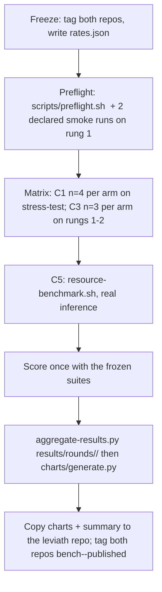

# Benchmark methodology

This document is the contract every published Leviath benchmark number must
satisfy. It exists because the July 2026 round failed an internal audit and
was withdrawn — the failure modes are documented in
`results/archive-2026-07/README.md` and each rule below closes one of them.

## What is measured, and what deliberately is not

Leviath is an agent **framework**. We do not publish head-to-head numbers
against agent products (Claude Code, Codex, Pi, OpenCode, …): they sit at a
different layer, any purpose-built baseline of ours is permanently open to the
"you wrote the loser" objection, and our withdrawn round demonstrated exactly
that failure. Everything below is either an **ablation of Leviath against
itself** or an **absolute measurement** with no comparison bars.

### C1 — Structured vs flat context (ablation, flagship)

Two arms, same Leviath binary, same pinned model, same tools, same task:

- **structured**: a frozen multi-stage blueprint with context regions
  (`blueprints/engineer-v3/`).
- **flat**: `blueprints/flat-mode/` — one stage, one sliding conversation
  window, no `context_*` tools. It inherits the runtime's full prompt-caching
  machinery, so any structured win on tokens is conservative.

Outcome measures per run: held-out suite pass rate, total billed tokens, cost,
wall-clock, tool calls. This is an ablation of the region system — it makes no
claim about any external product.

### C2 — Cache-honest token and cost accounting

All token numbers come from **API-reported usage fields** (`input_tokens`,
`output_tokens`, `cache_creation_input_tokens`, `cache_read_input_tokens`) —
never from character heuristics. One cost formula (`scripts/cost.py`) at rates
pinned in the round's `rates.json`, applied identically to both arms,
including cache read/write pricing. **Cache hit rate is published for both
arms even where Leviath's is worse** — region restructuring invalidates
prompt prefixes, and the honest framing is that structured context trades
cache locality for retention; the total-billed-token number already prices
that trade in. If total tokens are not lower, we publish that.

### C3 — Task-completion ladder

Rungs of increasing tool-call horizon (`cli-tool` → `rest-api` →
`stress-test`; `stress-test` reuses the C1 runs). **Completion** := pass rate
≥ 80% on the held-out suite within a pre-registered budget (token cap and
per-stage iteration caps, frozen in the tag). Report k/n completed per cell
plus every underlying pass rate. Scope caveat carried with any claim: single
domain (Python services); ceiling results don't generalize beyond it.

### C4 — Retention probes (independent grading)

`tasks/*/probes.json` questions injected at pre-registered tool-call counts,
graded by a **different provider's** pinned model via `evaluator/` with
committed rubrics. Probe injection perturbs the run; it is injected
identically in both arms and disclosed. Status: **not yet wired into the
runner** — if wiring isn't complete at freeze time, C4 is cut from the round
rather than shipped half-done.

### C5 — Resource footprint (absolute, appendix only)

`scripts/resource-benchmark.sh`: peak RSS of one `lev serve` process tree at
1/10/25/50 concurrent agents running **real inference**. The script emits the
published file byte-for-byte — hand-edited results are forbidden — and a
concurrency level is invalid unless every agent spawned and none failed.
No competitor bars, ever; the earlier cross-tool RSS figures were withdrawn
(the Leviath side had used dry-run inference).

## Hard rules

1. **Freeze before running.** Tag this repo and the leviath repo
   (`bench-YYYY-MM-rN`) covering: task files, seed files, validation suites,
   probes, both blueprints, grader model + rubrics, `rates.json`, completion
   thresholds, n, and budget caps. Any post-tag change to `tasks/` or
   `blueprints/` ⇒ new tag ⇒ full re-run. Every result file records the tag;
   `scripts/aggregate-results.py` refuses runs whose `freeze_tag` doesn't
   match the round.
2. **Tests are "held out", never "hidden".** The agent never sees test code,
   but task specs legitimately encode contracts (including specified
   algorithms). Suites are split into **public acceptance criteria**
   (behaviors the task states) and **held-out edge cases** (not stated
   verbatim); both pass rates are reported, and the edge-case rate is the one
   that resists teaching-to-the-test. Any grader or suite change after runs
   ⇒ re-score every run or discard the round. (Split labeling is a freeze
   prerequisite for the next round.)
3. **No run selection.** Every run — crashes, outliers, budget cap-outs —
   gets a committed raw record under `results/rounds/<tag>/runs/` (billed
   usage, scores, durations) plus per-request logs under the same tree.
   Cap-outs count as non-completion. The only discarded runs are the two
   rung-1 smoke runs declared *before* the round starts.
4. **Small-n statistics.** Publish median, min/max, and all points. Headline
   comparisons use the exact one-sided Mann-Whitney rank-sum p-value (in the
   aggregator) under the pre-registered hypothesis: structured scores higher
   and bills fewer tokens. No t-intervals on 4-point samples.
5. **Pin and disclose.** Exact model IDs (one pinned model per arm — no
   fallback chains during benchmark runs; if a fallback ever fires, disclose
   every occurrence), both repo commit hashes, run dates, OS/hardware,
   evaluator model, Python/pytest versions, and provider pricing as captured
   in `rates.json` (with source URL and date). Provider-side model drift
   between rounds is uncontrollable and therefore stated.
6. **Charts read only committed data.** Every chart carries: n, model ID,
   run dates, freeze tag, "costs from provider-billed usage at rates as of
   <date>", and the exact p-value wherever a comparison is claimed.

## Run protocol



Budget guard: pre-registered per-run spend cap (default $60, from billed
usage); a capped run is recorded and counts as non-completion. Round target
≈ $210–380, hard cap $400.

## Reproducing a published round

```bash
git checkout <freeze-tag>
scripts/preflight.sh <freeze-tag>
scripts/reproduce-everything.sh <freeze-tag>   # re-aggregates + re-charts from committed runs
```

Re-running the agents themselves reproduces the *protocol*, not the exact
numbers (models are nondeterministic and drift server-side); what must always
reproduce byte-for-byte is the path from committed raw runs → aggregate →
charts.
