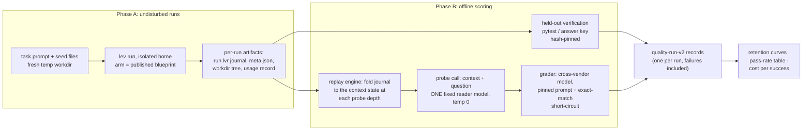
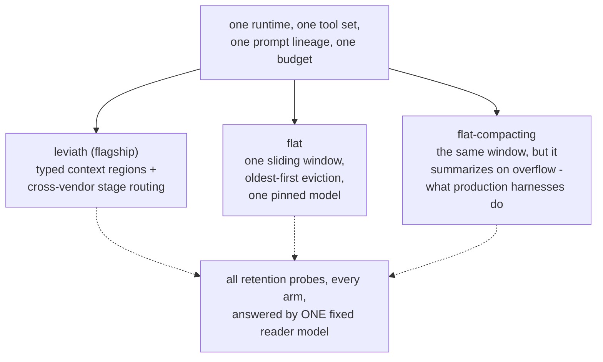
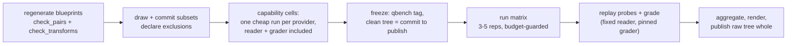

# Context Retention Suite — methodology

*The published quality benchmark for Leviath. The performance track
(memory / throughput / cold start) is documented in the repo-root
METHODOLOGY.md; this document covers the quality claim only.*

---

## The thesis under test

**As task depth grows, structured context degrades slower than flat
context.** Every agent setup works at 20 tool calls. The question this
suite answers is what happens at 100.

Leviath is an agent **runtime**, not a harness and not a coding agent.
What it manages is the context: typed regions (pinned, compacting,
temporary, sliding) instead of one window, and per-stage model routing
instead of one model. The suite measures whether that layer earns its
keep — nothing else. **No comparison to any coding agent, harness, or
other framework is made or implied**; both sides of every comparison
are this runtime, running published blueprints.

## What is measured

1. **Retention** (headline): the probability that a fact read early in
   the run is still recoverable from the agent's context at tool-call
   depth N. Plotted as probe accuracy vs depth, per arm.
2. **Task outcome**: held-out verification of the artifact the run
   produced (pytest suites for coding tasks, exact answer keys for
   non-coding tasks).
3. **Cost per successful outcome**: total arm spend divided by passing
   runs. Cost per run rewards cheap failure; cost per success is the
   number a buyer actually pays.

## The arms

Three arms; every one is the same runtime binary, the same tools, the
same prompts, the same total iteration budget (`check_pairs.py`
enforces the invariants mechanically — a violation fails the round
before it runs).

- **flat** — a single-stage loop with one conversation window that
  evicts oldest-first: today's typical setup. Generated from the
  structured blueprint by `blueprints/make_flat.py`, so it can never
  drift from its sibling; it is a baseline, not a strawman.
- **flat-compacting** — identical except the window summarizes its
  oldest entries on overflow instead of dropping them, which is what
  production harnesses actually do. The generator makes the overflow
  strategy the *only* difference, and `check_pairs.py` asserts it.
- **leviath** — the composed flagship: typed regions, stage graph, an
  adversarial plan critic, and a **cross-vendor stage assignment**
  (frontier model plans; a different lab's model attacks the plan;
  workhorse model runs the loops; economy model reformats). This is
  the configuration the runtime recommends, so it is the configuration
  measured — deliberately *not* a same-model ablation. The full
  stage→model map is frozen in `blueprints/mixes.json` and published
  with every round.

**On the multi-model confound**, stated plainly: the flagship uses
several models and the flat arms use one, so the *task outcome*
comparison is a system claim — "the runtime as shipped vs a
single-model loop" — and is labeled as such. The **retention** headline
does not carry that confound: every probe, for every arm, is answered
by the same fixed reader model against the arm's journaled context, so
the curve compares what each arm's *context state* supports, not which
models produced it.

## Probing without touching the run

Injecting questions into a live run contaminates it: the probe and its
answer enter the context, spend budget, and can refresh the very facts
being tested. So runs execute **undisturbed**, and probes are asked
afterwards:

1. Every run's context history is journaled by the runtime
   (`run.lvr`: typed checkpoints and diffs, with the tool-call count
   at every point).
2. For each probe depth N, the harness reconstructs the exact
   provider-visible request at the first point where the run had made
   ≥ N tool calls (the actual count is recorded).
3. The probe question is appended as a user message — wrapped in a
   fixed, sha-pinned instruction ("answer from memory of your work so
   far; do not use tools") — and sent once, at temperature 0, to the
   fixed reader model.
4. A cross-vendor grader model scores the answer against the probe's
   expected value and rubric (4-point taxonomy). Probes with
   unambiguous expected values are exact-match short-circuited before
   any model grades them.

Runs that die early are probed too, up to the depth they reached;
deeper probes are recorded `reached: false` and every curve point
carries its n — the curve cannot silently survivorship-bias itself.
Probe and grading spend is recorded per run (`probe_overhead`) and
**excluded** from every cost comparison: it is measurement, not agent
spend.

Grading scale: correct = 1, partial = 0.5, wrong = 0. The grader also
flags hallucinated answers (confident inventions); the hallucination
**rate** is published as its own series and never enters the accuracy
mean as a negative number.

## Tasks

Long-horizon tasks across four agent families — the suite is about the
runtime, so most of it is deliberately not coding:

| task | kind | family | target depth |
|---|---|---|---|
| cli-tool | coding | coder | ~90 |
| rest-api | coding | coder | ~70 |
| stress-test | coding | coder | ~185 |
| incident-forensics | log forensics | log-analyzer | 100+ |
| records-reconciliation | data audit | analyst | 100+ |
| docs-audit | policy compliance | researcher | 100+ |

Coding tasks are verified by held-out pytest suites (hash-pinned, run
in a fresh venv). Non-coding tasks are **generated** by committed,
seeded generators that inject a known ground truth into a realistic
corpus and emit the answer key mechanically — nobody hand-writes an
answer, and regenerating with the committed seed is byte-identical.
Probes ask about facts in each task's reference documents (thresholds,
config values, schema details, policy rules) that a diligent agent
reads early and needs late.

Short tasks are excluded on purpose: under ~50 tool calls nothing
evicts, and every arm looks the same. That regime is covered by the
internal regression suites (DABstep, log-analysis), which are not
published benchmarks.

## Controls and honesty rules

Carried over from this repo's standing methodology, plus CRS-specific
ones:

- **Freeze before running.** A counted round runs on a `qbench-*` tag
  over a clean tree; blueprints, tasks, probes, rates, reader/grader
  models, and the probe wrapper are all sha-recorded in `round.json`.
  Freezing a counted round is the commitment to publish its result —
  whatever it shows. Exploration happens in unpublished smoke rounds,
  stamped `UNFROZEN-SMOKE`, which are never publishable.
- **No run selection.** Every run writes a record — errors, timeouts,
  and budget cap-outs included — and the round's raw tree is published
  whole or not at all.
- **Pre-registered comparisons and subsets.** Task subsets are seeded
  draws committed before the freeze; the arm comparisons are declared
  in code (`run_quality.py`); exclusions are declared with reasons
  before any run.
- **Exact small-sample statistics.** One-sided exact Mann-Whitney for
  arm comparisons; no t-intervals on n≤5; per-point n and exact
  p-values printed in chart footers.
- **Cache-honest accounting.** Token counts come from provider usage
  fields including cache reads and writes, priced at rates pinned per
  round. Per-task presentation is primary; the pooled retention curve
  is secondary and annotated with its per-point composition.
- **Fresh workdir per run**, isolated daemon home per invocation, keys
  never written into results (a secret scrub refuses to exit clean
  otherwise).

## The caching tradeoff, documented rather than hidden

Structured context currently pays a real caching penalty on Anthropic
models: region mutations rewrite the provider-visible prefix, so a
structured run re-bills context as cache *writes* that a flat run reads
back at a tenth the price (measured in this repo's 2026-08-13 round: an
arm whose bill was 84% cache writes; hit rate 0.15 vs 0.62 flat). Root
cause and proposed fixes are filed as
[leviath#418](https://github.com/GEMISIS/leviath/issues/418); the
measured projection is cost parity once fixed. Until it lands, CRS cost
tables carry the penalty openly — cost-per-success is reported with it
included, because that is what a user pays today.

## What this suite does NOT claim

- It does not compare Leviath to any other framework, harness, or
  coding agent. External suites with public leaderboards exist for
  cross-tool comparison; this is not that.
- It does not measure model quality. The retention headline is
  reader-model-controlled; the outcome comparison is a configuration
  claim about one runtime.
- It does not benchmark prompt engineering: prompts share one lineage
  across arms and are published.
- A retention win does not by itself claim task-outcome superiority —
  the two dimensions are reported separately, and either can come out
  against structure. Whatever a frozen round shows is what gets
  published.

## Round protocol

